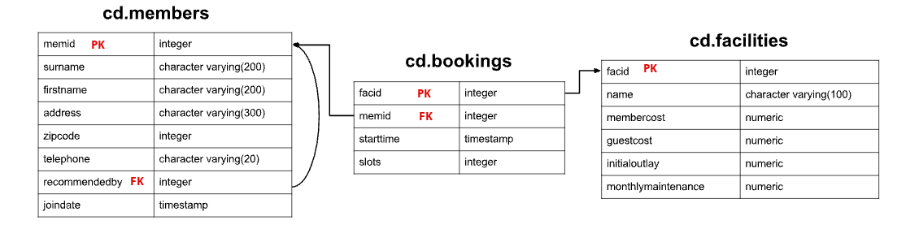

# Introduction
In this project, we have been given a dataset pertaining to a newly established country club. The dataset contains information about club members, different amenities like tennis courts, and a record of bookings made for those amenities. The entity-relationship diagram illustrating the tables is provided below. The primary goal of the club is to analyze and evaluate facility usage and demand efficiently using this dataset. To achieve this objective, we utilize PostgresSQL for analyzing the given tables within a Docker environment.




## Data Loading

###### Pandas

```python
import pandas as pd

bookings = pd.read_csv('bookings.csv')
facilities = pd.read_csv('facilities.csv')
members = pd.read_csv('members.csv')
```

###### PySpark

```python
from pyspark.sql import SparkSession

# Create a SparkSession
spark = SparkSession.builder.getOrCreate()

# Read the bookings and members tables into DataFrames
bookings_df = spark.read.csv("bookings.csv", header=True, inferSchema =True)
members_df = spark.read.csv("members.csv", header=True, inferSchema =True)
facilities_df = spark.read.csv("facilities.csv", header=True, inferSchema =True)
```

## Modifying Data

###### Question 1: How can you produce a list of the start times for bookings by members named 'David Farrell'?

###### Pandas

```python
result = bookings.merge(members, on='memid', how='inner')
result = result[(result.firstname == 'David') & (result['surname'] == 'Farrell')]
result = result[['surname','firstname','starttime']]
result.head()
```

###### PySpark

```python
# Perform the join and apply the filter
result_df = bookings_df.join(
    members_df,
    bookings_df.memid == members_df.memid
).where(
    (members_df.firstname == "David") &
    (members_df.surname == "Farrell")
).select(bookings_df.starttime)

# Show the result
result_df.show()
```

###### Questions 2:How can you produce a list of the start times for bookings for tennis courts, for the date '2012-09-21'? Return a list of start time and facility name pairings, ordered by the time.

###### Pandas

```python
result = facilities.merge(bookings, on='facid', how='inner')

# Apply conditions to filter rows based on 'name' and 'starttime' columns
result = result[result['name'].str.startswith('Tennis Court') &
                (result['starttime'] >= '2012-09-21') &
                (result['starttime'] < '2012-09-22')]

# Select specific columns
result = result[['starttime', 'name']]

# Sort by starttime
result = result.sort_values(by='starttime')
result.head()
```

###### PySpark

```python
result_df = facilities_df.join(
    bookings_df,
    facilities_df.facid == bookings_df.facid,
    "inner"
).where(
    (facilities_df["name"].like("Tennis Court%")) &
    (bookings_df["starttime"] >= '2012-09-21') &
    (bookings_df["starttime"] < '2012-09-22')
).select(
    bookings_df["starttime"].alias("starttime"),
    facilities_df["name"].alias("name")
).orderBy("starttime")

# Show the result
result_df.show()
```

###### Questions 3: How can you output a list of all members, including the individual who recommended them (if any), without using any joins? Ensure that there are no duplicates in the list, and that each firstname + surname pairing is formatted as a column and ordered.

###### Pandas
 
```python
def get_recommender_name(row):
    if pd.notnull(row['recommendedby']):
        recommender = members.loc[row['recommendedby'] == members['memid'], ['firstname', 'surname']]
        return recommender['firstname'].values[0] + ' ' + recommender['surname'].values[0]
    else:
        return None

members['recommender'] = members.apply(get_recommender_name, axis=1) # assign the new column (x=1) to members table

members['member'] = members['firstname'] + ' ' + members['surname']

result = members[['member', 'recommender']].sort_values(by='member')

result.head()
```

###### PySpark

```python
from pyspark.sql.functions import concat, lit, when

unique_list = [r["recommendedby"] for r in members_df.select("recommendedby").collect()]
    
r_list = []
for index in unique_list:
    if index != None:
        r_name = members_df.where(index == col("memid")).select(concat("firstname", lit(" ") ,"surname").
                                                                alias("recommder")).head(1)
        r_list.append(r_name[0]['recommder'])
    else:
        r_list.append("Null")
result_df = members_df.withColumn("Recommender", lit(None).cast("string"))

for i, value in enumerate(unique_list):
    result_df = result_df.withColumn("Recommender", when(col('recommendedby') == value, r_list[i]).otherwise(col("Recommender")))

result_df = result_df.select(concat(result_df["firstname"], lit(' ') ,result_df["surname"]).alias("member"),
    result_df["Recommender"]).show()
```

###### Questions 4: Produce a count of the number of recommendations each member has made. Order by member ID.

###### Pandas

```python
filtered_members = members[members['recommendedby'].notnull()]

# Group by 'recommendedby' column and get count
# result = filtered_members.groupby('recommendedby')['recommendedby'].size().reset_index(name='count')
result = filtered_members.groupby('recommendedby').agg(count=("recommendedby","count")).reset_index()

# Sort by 'recommendedby' column
result = result.sort_values(by='recommendedby')

result.head() 
```

###### PySpark

```python
from pyspark.sql.functions import count

# from pyspark.sql.window import Window

result_df = members_df.where(members_df["recommendedby"].isNotNull()) \
                      .groupBy("recommendedby") \
                      .agg(count("*").alias("count")) \
                      .orderBy("recommendedby")

# Show the result
result_df.show()
```

###### Questions 5: Produce a list of the total number of slots booked per facility. For now, just produce an output table consisting of facility id and slots, sorted by facility id.

###### Pandas

```python
result = bookings.groupby('facid')['slots'].sum().reset_index(name="Total Slots")

result = result.sort_values(by='facid')

result.head()
```  

###### PySpark

```python
from pyspark.sql.functions import sum

# Perform the query using DataFrame operations
result_df = bookings_df.groupBy("facid") \
                       .agg(sum("slots").alias("total_slots")) \
                       .orderBy("facid")

# Show the result
result_df.show()
```

###### Questions 6: Produce a list of the total number of slots booked per facility in the month of September 2012. Produce an output table consisting of facility id and slots, sorted by the number of slots.

###### Pandas

```python
filtered_bookings = bookings[(bookings['starttime'] >= '2012-09-01') & (bookings['starttime'] < '2012-10-01')]

# Group by 'facid' and 'month' columns and calculate the sum of 'slots'
# result = filtered_bookings.groupby(['facid'])['slots'].sum().reset_index(name="Total Slots")
result = filtered_bookings.groupby('facid').agg(total_slots=('slots','sum')).reset_index()

# Sort by 'facid' and 'month' columns
result = result.sort_values(by=['total_slots'],ascending=True)

result.head()
``` 

###### PySpark

```python
from pyspark.sql.functions import sum, col

# Perform the query using DataFrame operations
result_df = bookings_df.where((col("starttime") >= '2012-09-01') & (col("starttime") < '2012-10-01')) \
                       .groupBy("facid") \
                       .agg(sum("slots").alias("total_slots")) \
                       .orderBy("total_slots")

# Show the result
result_df.show()
```

###### Questions 7: Produce a list of the total number of slots booked per facility per month in the year of 2012. Produce an output table consisting of facility id and slots, sorted by the id and month.

###### Pandas

```python
filtered_bookings = bookings[(bookings['starttime'] >= '2012-01-01') & (bookings['starttime'] < '2013-01-01')]

# Extract month from 'starttime' column
filtered_bookings['month'] = pd.to_datetime(filtered_bookings['starttime']).dt.month

# Group by 'facid' and 'month' columns and calculate the sum of 'slots'
# result = filtered_bookings.groupby(['facid', 'month'])['slots'].sum().reset_index()
result = filtered_bookings.groupby(['facid', 'month']).agg(total_slots=('slots','sum')).reset_index()

# Sort by 'facid' and 'month' columns
result = result.sort_values(by=['facid', 'month'])

result.head()
``` 

###### PySpark

```python
from pyspark.sql.functions import sum, col, month, to_date

# Perform the query using DataFrame operations
result_df = bookings_df.filter((col("starttime") >= '2012-01-01') & (col("starttime") < '2013-01-01')) \
                       .groupBy("facid", month(to_date(col("starttime"),'yyyy-mm-dd')).alias("month")) \
                       .agg(sum("slots").alias("total_slots")) \
                       .orderBy("facid", "month")

# Show the result
result_df.show()
```

###### Questions 8: Find the total number of members (including guests) who have made at least one booking.

###### Pandas

```python
result = bookings['memid'].nunique()

result.head()
```

###### PySpark

```python
from pyspark.sql.functions import count

# Perform the query using subqueries and count()
result_df = bookings_df.select("memid").distinct() \
                       .select(count("*").alias("count"))

# Show the result
result_df.show()
```

###### Questions 9: Produce a list of each member name, id, and their first booking after September 1st 2012. Order by member ID. 

###### Pandas

```python
result = bookings.merge(members, on='memid', how='left')

# Apply condition to filter rows based on 'starttime' column
result = result[result['starttime'] >= '2012-09-01']

# Group by 'memid', 'surname', and 'firstname' columns and retrieve the minimum 'starttime'
result = result.groupby(['memid', 'surname', 'firstname']).agg(min_starttime=('starttime', 'min')).reset_index()

# Sort by 'memid' column
result = result.sort_values(by='memid')

result.head()
``` 

###### PySpark

```python
from pyspark.sql.functions import min

# Perform the query using DataFrame operations
result_df = bookings_df.join(
    members_df,
    bookings_df.memid == members_df.memid,
    "left"
).where(
    bookings_df.starttime >= '2012-09-01'
).groupBy(
    bookings_df["memid"], "surname", "firstname"
).agg(
    min(bookings_df["starttime"]).alias("min_starttime")
).orderBy(
    bookings_df["memid"]
).select(
    "surname", "firstname", bookings_df["memid"], "min_starttime"
)

# Show the result
result_df.show()
```

###### Questions 10: Output the names of all members, formatted as 'Surname, Firstname'

###### Pandas

```python
members['name'] = members['surname'] + ', ' + members['firstname']

# Select only the 'name' column
result = members['name']

result.head()
``` 

###### PySpark

```python
from pyspark.sql.functions import concat, lit

# Perform the query using DataFrame operations
result_df = members_df.select(concat(members_df["surname"], lit(' '), members_df["firstname"]).alias("name"))

# Show the result
result_df.show()
```

###### Questions 11: Perform a case-insensitive search to find all facilities whose name begins with 'tennis'. Retrieve all columns.

###### Pandas

```python
facilities['name'] = facilities['name'].str.lower()

# Apply condition to filter rows based on uppercase 'name' column
result = facilities[facilities['name'].str.startswith('TENNIS')]

result.head()
``` 

###### PySpark

```python
from pyspark.sql.functions import upper

result_df = facilities_df.filter(upper(facilities_df["name"]).like("TENNIS%"))

# Show the result
result_df.show()
```

###### Questions 12: You've noticed that the club's member table has telephone numbers with very inconsistent formatting. You'd like to find all the telephone numbers that contain parentheses, returning the member ID and telephone number sorted by member ID.

###### Pandas

```python
# Apply condition to filter rows based on 'telephone' column using regular expression matching
result = members[members['telephone'].str.contains('[()]', regex=True)]

# Select only the 'memid' and 'telephone' columns
result = result[['memid', 'telephone']]

result.head()  
``` 

###### PySpark

```python
result_df = members_df.filter(members_df["telephone"].rlike("[()]")) \
                      .select("memid", "telephone")

# Show the result
result_df.show()
```

###### Questions 13: You'd like to produce a count of how many members you have whose surname starts with each letter of the alphabet. Sort by the letter, and don't worry about printing out a letter if the count is 0.

###### Pandas

```python
members['letter'] = members['surname'].str.slice(0, 1)

# Group by 'letter' column and calculate the count
# result = members.groupby('letter')['letter'].size().reset_index(name='count') # reset index and give name to new column
result = members.groupby('letter').agg(count=('letter','count')).reset_index()

# Sort by 'letter' column
result = result.sort_values(by='letter')

result.head()
``` 

###### PySpark

```python
from pyspark.sql.functions import count, substring

# Perform the query using DataFrame operations
result_df = members_df.select(substring(members_df["surname"], 1, 1).alias("letter")) \
                      .groupBy("letter") \
                      .agg(count("*").alias("count")) \
                      .orderBy("letter")

# Show the result
result_df.show()
```
